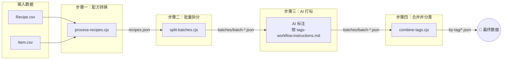

# 数据脚本说明

本目录包含 FFXIV「今天吃什么」项目的数据处理脚本，用于将游戏原始 CSV 数据转换为前端使用的 JSON 文件。

## 数据流概览



## 脚本列表

### 1. `process-recipes.cjs` — 配方转换（CSV → JSON）

将游戏原始 `Recipe.csv` 和 `Item.csv` 转换为前端可用的食物配方 JSON。

**功能：**

- 从 `Recipe.csv` 中过滤出 `CraftType == 7`（制作食物）的配方
- 查找成品 `Item{Result}` 及其配料 `Item{Ingredient}[0~7]`
- 从 `Item.csv` 查询物品名称、描述、图标
- 仅保留描述中包含食物经验加成效果的可食用条目
- 可配置排除项（名称黑名单、`RecipeNotebookList` 黑名单等）

**用法：**

```bash
node scripts/process-recipes.cjs <Recipe.csv路径> <Item.csv路径> [输出目录]
```

**输出：** `public/data/recipes.json`

**默认输出目录：** `public/data/`

---

### 2. `split-batches.cjs` — 拆分为批量文件（用于 AI 打标）

将 `recipes.json` 按每批 50 条拆分为多个小文件，便于分批次进行 AI 分类打标。

**功能：**
- 每条仅保留 `item`、`name`、`description` 三个字段
- 按 `batch-${编号}.json` 命名（补零，如 `batch-01.json`）

**用法：**
```bash
node scripts/split-batches.cjs
```

**输入：** `public/data/recipes.json`
**输出：** `public/data/batches/batch-01.json` ~ `batch-N.json`

---

### 3. `tags-workflow.instructions.md` — AI 打标指令

提供给 AI 的分类标注规范文档，定义了 11 种食物分类体系（主食、肉类、海鲜、汤品、沙拉、配菜、炖菜、蛋料理、甜点、饮品、零食）。

**用途：** 将每个 batch 文件喂给 AI，按此规范输出带 `tag` 字段的 JSON。

**输入格式：** `{ item, name, description }`
**输出格式：** `{ item, name, description, tag: string[] }`

**输出文件命名：** `batch-${编号}.json`（如 `batch-01.json`）

---

### 4. `combine-tags.cjs` — 合并打标结果并分类

读取 tagged batch 文件后将 tag 合并到完整数据，再直接按 tag 分组输出独立文件。

**功能：**
- 读取 `recipes.json` 和 `batches/batch-*.json`
- 按 `item` ID 匹配，将 tag 合并到完整数据中
- 未找到 tag 的条目自动设为 `tag: []`
- 按 tag 分组输出到 `by-tag/` 目录（一个条目有多个 tag 则出现在多个文件中）
- 完成后**自动清理** `batches/` 目录下的所有临时 batch 文件

**用法：**
```bash
node scripts/combine-tags.cjs
```

**输入：** `public/data/recipes.json` + `public/data/batches/batch-*.json`
**输出：** `public/data/by-tag/{分类名称}.json`

---

---

### 5. `download-icons.cjs` — 下载物品图标

读取 `recipes.json` 中所有不重复的 item ID，通过 XivAPI 逐一获取图标路径并下载 JPG 图片。

**功能：**
- 自动提取 `recipes.json` 中所有不重复的 item ID 并排序
- 调用 `https://v2.xivapi.com/api/sheet/Item/{id}?fields=Icon` 获取图标资源路径
- 调用 `https://v2.xivapi.com/api/asset?path={path_hr1}&format=jpg` 下载图片
- **每处理一条数据间隔 10 秒**，避免请求过快
- 单个 item 失败不影响后续处理
- 图片保存为 `public/data/icons/{itemId}.jpg`

**用法：**
```bash
node scripts/download-icons.cjs
```

**输入：** `public/data/recipes.json`
**输出：** `public/data/icons/{itemId}.jpg`

---

> **旧脚本：** `merge-tags.cjs` 和 `split-by-tag.cjs` 仍保留但已弃用，建议统一使用 `combine-tags.cjs`。

---

## 完整工作流程

```bash
# 1. 从 CSV 提取食物配方
node scripts/process-recipes.cjs scripts/Recipe.csv scripts/Item.csv

# 2. 拆分为 50 条一批的小文件
node scripts/split-batches.cjs

# 3. 将 batch-*.json 按 tags-workflow.instructions.md 规范交给 AI 打标
#    → 输出 batch-*.json

# 4. 合并打标结果并按 tag 分类
node scripts/combine-tags.cjs
```

## 数据文件说明

| 文件 | 说明 |
|------|------|
| `Item.csv` | 游戏物品数据（名称、描述、图标 ID 等） |
| `Recipe.csv` | 游戏配方数据（配方类型、成品、配料、配方书等） |
| `public/data/recipes.json` | 转换后的食物配方（含成品、配料、图标） |
| `public/data/batches/` | 拆分后的临时 batch 文件（每次运行自动清理） |
| `public/data/by-tag/*.json` | 按 tag 分类的最终数据文件 |
